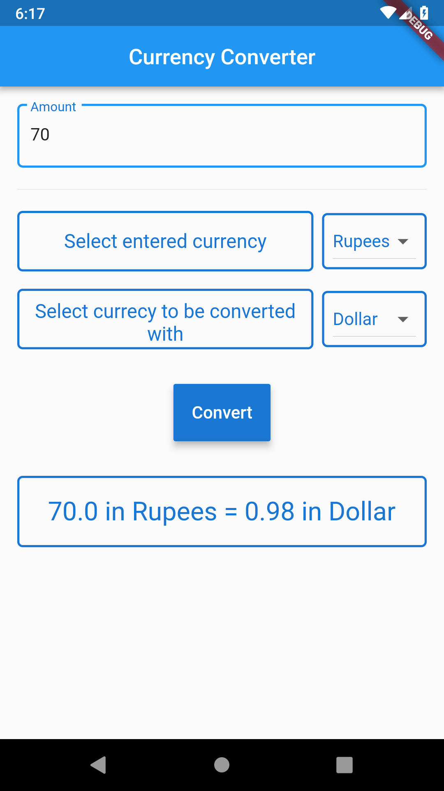

# Currency Converter

A currency converter app in Flutter.
Using [openrates.io](http://www.openrates.io/) api to get the latest currency values.

A web version of this app is made in [web branch](https://github.com/RitamChakraborty/currency_converter/tree/web)

Checkout the Website [here](https://ritamchakraborty.github.io/currency_converter/#/)

    

