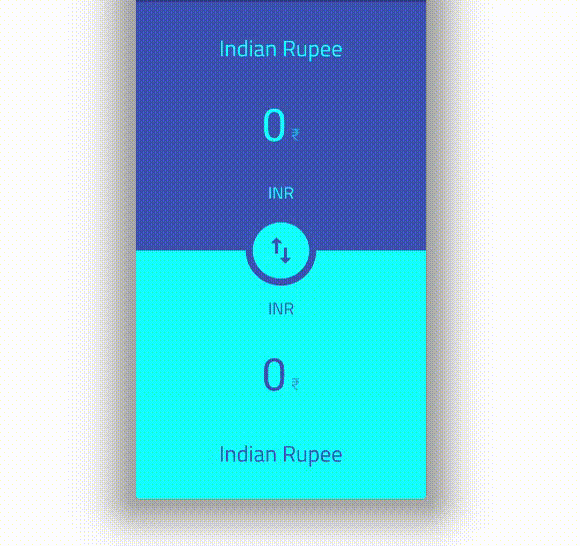

# Currency Converter

 A currency converter application made with <i>Flutter</i>.

### Features

- Supports 32 currency types
- Persistent selection of the selected currencies
- Cool animations

## Demo

    

## API

For the currency rates open source [Frankfurter API](https://www.frankfurter.app/) is used.

## Design

The app is built following the [Stylish Currency Converter](https://dribbble.com/shots/4816296-Stylish-Currency-Converter-iOS-app) mock up create by [Oleg Frolov](https://dribbble.com/Volorf)

## Credit 

- Thanks [Shatanik](https://github.com/shatanikmahanty) for helping with the auto scrolling feature
- Thanks [Shuktika](https://github.com/Shuktika15) for creating the app icon, helping me decide the colors